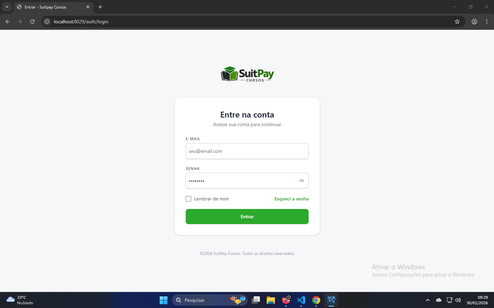
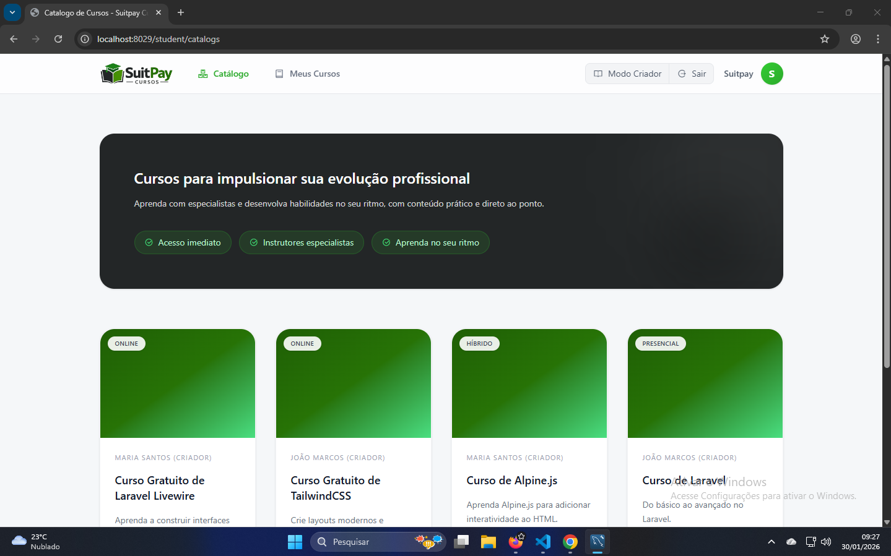
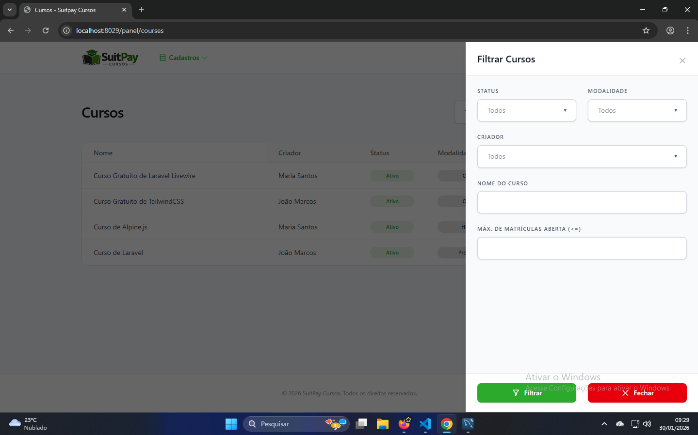
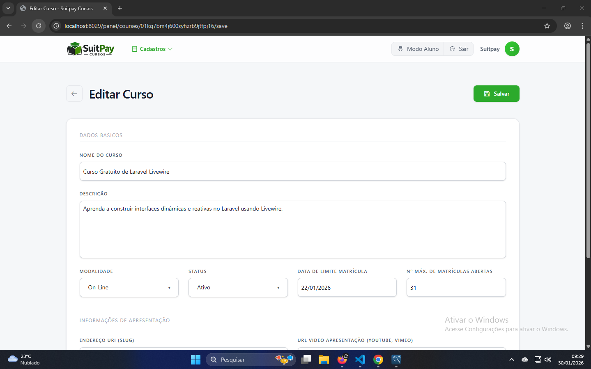
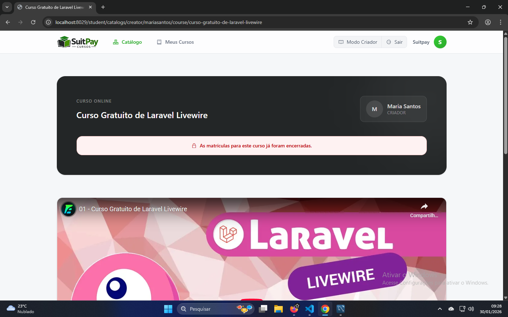

# 🚀 SuitPay Cursos — Rodando Local com Docker

Projeto Laravel configurado para rodar 100% via **Docker**.

---

## 🔐 Login de Teste (Acesso Rápido)

Use após subir o sistema:

| Tipo | Email | Senha |
|------|------|------|
| 👑 Administrador | suitpay@mail.com | password |
| 🎓 Criador | maria@mail.com | password |
| 🎓 Criador | joao@mail.com | password |
| 👨‍🎓 Aluno | gustavo@mail.com | password |
| 👨‍🎓 Aluno | danilo@mail.com | password |

---

## ✅ Requisitos

- Docker  
- Docker Compose  
- Git  

---

## 📥 Clonar o projeto

```bash
git clone https://github.com/higorch/suitpaycursos.git
cd suitpaycursos
```

---

## 🐳 Subir os containers

```bash
docker compose up -d
```

Aguarde cerca de **15 segundos** para o MySQL iniciar completamente, mesmo depois de os containers estarem em execução.

---

## ⚙️ Configuração inicial

Entre no container da aplicação:

```bash
docker exec -it app bash
```

Dentro do container rode:

```bash
composer install
cp .env.example .env
php artisan key:generate
```

---

## 🛠️ Configurar o banco

Edite o arquivo `src/.env` e deixe assim:

```env
DB_CONNECTION=mysql
DB_HOST=mysqlsutipaycursos
DB_PORT=3306
DB_DATABASE=laravel
DB_USERNAME=laravel
DB_PASSWORD=secret
```

---

## 🗄️ Criar banco e dados de teste

Ainda dentro do container:

```bash
php artisan migrate --seed
exit
```

Isso cria automaticamente:
- Usuários (Administradores, Criadores e Alunos)
- Cursos de exemplo

---

## 🌐 Acessar o sistema

Abra no navegador:

**http://localhost:8029**

Você será redirecionado para a tela de login.

---

## 🧠 Portas dos serviços

| Serviço | Porta |
|--------|------|
| Aplicação (Nginx) | **8029** |
| MySQL (acesso externo) | **3329** |

> Internamente o Laravel usa a porta **3306** para o banco.

---

## 🐳 Comandos úteis Docker

Parar containers:

```bash
docker compose down
```

Reconstruir containers:

```bash
docker compose up -d --build
```

Acessar container da aplicação:

```bash
docker exec -it app bash
```

---

## 📌 Observações

- Caso o banco não conecte de primeira, aguarde mais alguns segundos e rode novamente o migrate.
- Se alterar variáveis de ambiente, reinicie os containers.

---

## 📸 Telas do Sistema

### 🔐 Tela de Autenticação


### 📚 Catálogo de Cursos


### 🎯 Filtro de Cursos


### 📝 Formulário


### 📄 Página do Curso

